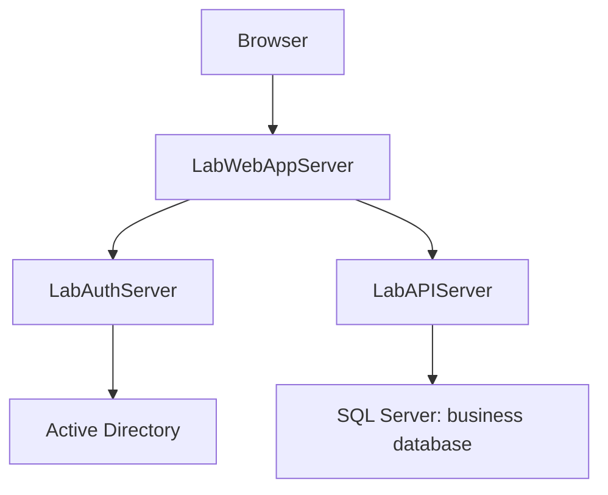

# Architecture

## Three-application architecture

- **LabAuthServer** owns authentication against Active Directory, verified identity and role issuance in signed JWTs. Its own SQL audit store is separate from the API business database. Auth signing keys and directory service credentials belong only to Auth.
- **LabAPIServer** owns business APIs, bearer-token validation, authorization enforcement, business rules and SQL access through stored procedures. It does not issue tokens or authenticate passwords against AD.
- **LabWebAppServer** owns the user interface, session/cookie handling and server-side Auth/API clients. After Auth login it calls the API session endpoint to obtain the verified identity/role before creating a local session. Bearer tokens remain server-side; the browser receives a protected session cookie. Web does not access SQL, own Auth keys or grant API permissions.

HTTPS protects browser and service traffic; LDAPS protects Auth-to-directory traffic. API owns the final allow/deny decision on every business request, even when Web hides unavailable actions. Session loss on Web recycle requires login again. Deployment settings, credentials, certificates and database provisioning remain environment-managed, outside CI source artifacts.

This diagram describes existing responsibility boundaries, not a change to authentication, application behavior or deployment topology.
